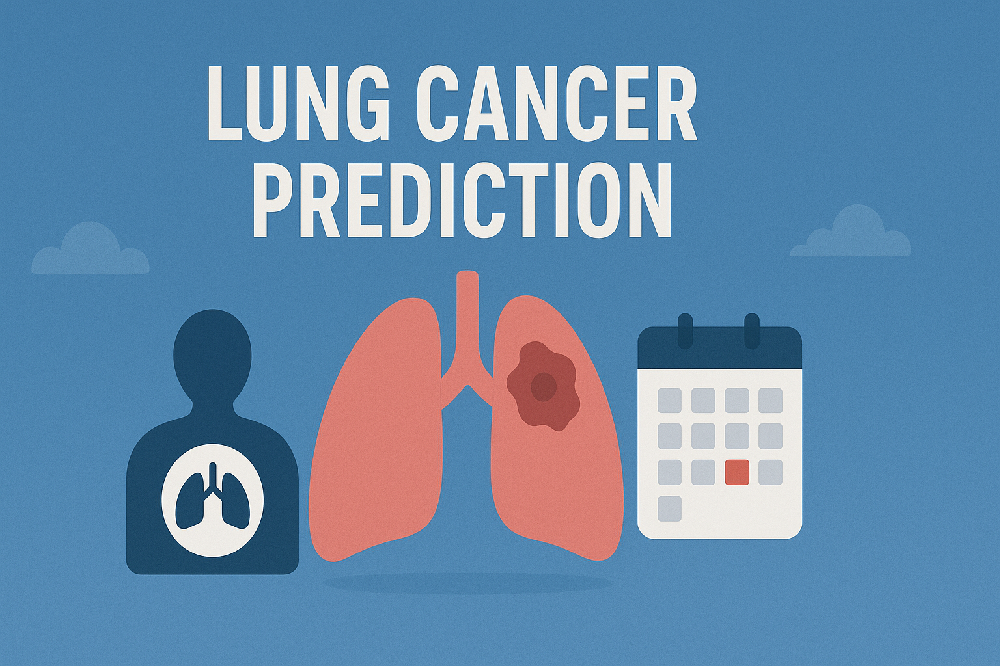

</a> Unified Mentor Private Limited 

  
<!-- Image Logo -->

    

 

<!-- project and ML title -->
<h1 align='center' style="margin-bottom: 0px;">
<!-- <a href="https://git.io/typing-svg"> -->
  
</a></h1>

<!-- ML name -->
<h4 align='center' style="margin-top: 0; margin-bottom: 10px;">
<!-- <a href="https://git.io/typing-svg"> -->
  
</a></h4>

---
 
<!-- Table of content -->
## Table of Contant

* 
About this Project.

* 
Problem Statment.

* 
What DataSet cointains?

* 
Main library to be used.

* 
Visualizations/Chart.

* 
Conclusion.

* 
Acknowledgment.

 

---
<!-- About this Project -->
  
<h2>About this Project</h2>

    This project focuses on predicting the survival of Lung cancer using a dataset containing various clinical and demographic factors.
    The notebook covers the following main steps:

<ul style="font-size:15px; line-height:1.6; margin-left:20px;">
    <li><b>Data Loading and Understanding:</b> Load the dataset and explore its basic characteristics, including row and column count, data types, duplicate values, and missing values.</li>
    <li><b>Exploratory Data Analysis (EDA):</b> Visualize and analyze relationships between different variables and the target variable (survived) to gain insights.</li>
    <li><b>Hypothesis Testing:</b> Perform statistical tests to validate hypotheses about relationships between variables.</li>
    <li><b>Feature Engineering & Data Pre-processing:</b> Prepare the data for machine learning by splitting it into training and testing sets and scaling numerical features.</li>
    <li><b>ML Model Implementation:</b> Train and evaluate multiple machine learning models (Logistic Regression, Decision Tree, Random Forest, SVM, KNN and XGB) to predict the survival of patient.</li>
    <li><b>Model Selection and Conclusion:</b> Choose the best-performing model based on evaluation metrics and summarize the project findings.</li>
    <li><b>Future Work:</b> Save the best model for potential deployment and perform sanity checks with test data.</li>
</ul>
  

---
 
<h2>Problem Statement</h2>

    Lung Cancer is a serious health issue with varying stages of severity. 
    Accurately predicting the stage of cancer stage is crucial for effective patient management and treatment planning. 
    This project aims to develop a machine learning model that can predict the stage of Lung Cancer based on patient data.

    Here are some key questions explored in this study:

<ul style="font-size:15px; line-height:1.6; margin-left:20px;">
    <li>Can we predict the stage of Lung Cacner based on clinical and demographic factors?</li>
    <li>Which factors are most influential in determining the stages of cancer?</li>
    <li>Are there specific patterns in the data that differentiate between the stages?</li>
    <li>How do different machine learning models perform in predicting cancer stages?</li>
    <li>Can our model help in early identification of advanced lung cancer stages?</li>
    <li>What is the potential impact of treatments on cancer progression across stages?</li>
</ul>
 

---

  

<!-- What Data set Containes -->
<!-- columns and their descriptions -->
<!-- What Data set Containes -->
<!-- columns and their descriptions -->

    

    <h2>What the Dataset Contains</h2>

    The dataset includes various clinical, biochemical, and demographic features related to patients with liver cirrhosis. 
    Each feature provides important information that can help in predicting the disease stage.

<ul style="font-size:15px; line-height:1.6; margin-left:20px;">
    <li><b>id:</b> 890,000 - Unique identifier for each patient.</li>
    <li><b>age:</b>Patient's age at diagnosis.</li>
    <li><b>gender:</b> Patient's gender(e.g., male, female).</li>
    <li><b>country:</b>Patient's country or region of residence..</li>
    <li><b>diagnosis_data:</b> date of lung cancer diagnosis.</li>
    <li><b>cancer_stage:</b> Stage of lung cancer at diagnosis(e.g., stage I, Stage II, Stage III, Stage IV).</li>
    <li><b>family_history:</b> Whether there is a family history of cancer (e.g., yes, no).</li>
    <li><b>smoking_status:</b> Patient's smoking status (e.g., current smoker, former smoker, never smoked, passive smoker).</li>
    <li><b>bmi:</b> Patient's Body Mass Index at Diagnosis.</li>
    <li><b>cholesterol_level:</b> Patient's cholesterol level (value).</li>
    <li><b>hypertension:</b> Whether the patient has hifh blood pressure (e.g., yes, no).</li>
    <li><b>asthma:</b> Whther the patient has asthma (e.g., yes, no).</li>
    <li><b>cirrhosis:</b> Whether the patient has liver cirrhosis (e.g., yes, no).</li>
    <li><b>other _cancer:</b> Whether the patient has had another type of cancer besides the primary diagnosis (e.g., yes, no).</li>
    <li><b>treatment_type:</b> Type of treatment received (e.g., surgery, chemotherapy, radiation, combined).</li>
    <li><b>end_treatment_date:</b> Date when the patient completed treatment or died..</li>
    <li><b>survived:</b> Whether the patient survived (e.g., yes, no).</li>
</ul>

  

---
  
<!-- Library used in projects and their description -->

 
  
 Main Libraries Used 
 
    
  

  🔢 <b>NumPy</b> – For efficient numerical computations, array operations, and mathematical functions.  
  📊 <b>Pandas</b> – To load, clean, and manipulate structured datasets for analysis and modeling.  
  📈 <b>Matplotlib & Seaborn</b> – For creating visualizations such as histograms, heatmaps, and correlation plots to explore data patterns and relationships.  
  🧪 <b>SciPy</b> – Used for performing statistical analysis, outlier detection, and hypothesis testing.  
  ⚙️ <b>scikit-learn (sklearn)</b> – The main machine learning library used for:
  <ul> 
    <li>📦 Data preprocessing (<code>StandardScaler</code>)</li> 
    <li>🧠 Model building (<code>LogisticRegression</code>, <code>KNeighborsClassifier</code>, <code>SVC</code>, <code>DecisionTreeClassifier</code>, <code>RandomForestClassifier</code>,
    <code>XGBClassifier</code>)</li> 
    <li>🎯 Model evaluation (<code>accuracy_score</code>, <code>precision_score</code>, <code>recall_score</code>, <code>f1_score</code>,<code>ROC-AUC</code>, <code></code>, <code>confusion_matrix</code>, <code>ConfusionMatrixDisplay</code>)</li> 
    <li>🧩 Model tuning and validation (<code>train_test_split</code>, <code>cross_val_score</code>, <code>GridSearchCV</code>, <code>RandomizedSearchCV</code>)</li>
  </ul>
  
 

  

---
  

 Insights & Visualizations/Chart. 

<b>--- Hypothesis Test 1: Smoking Status vs Survival (Chi-Square) ---</b>

Chi-Square Value: 1.1198162562643716
Degrees of Freedom: 3
P-Value: 0.7722926422184736

Expected Frequency Table:
<li>[[173029.57798652 | 48868.42201348]</li>
<li>[173250.2531191  |  48930.7468809 ]</li>
<li>[173694.72246742  |  49056.27753258]</li>
<li>[174021.44642697  |  49148.55357303]]</li>

Interpretation:
Since p-value = 0.7722926422184736 >= 0.05, we FAIL to reject the Null Hypothesis.
➡ Smoking status does NOT have a statistically significant association with survival.

<b>--- Hypothesis Test 2: BMI vs Survival (T-Test) ---</b>

T-Statistic: 0.0063873395047639595
P-Value: 0.9949036791190105

Interpretation:
Since p-value = 0.9949036791190105 >= 0.05, we FAIL to reject the Null Hypothesis.
➡ BMI does NOT significantly differ between survivors and non-survivors.

<b>--- Hypothesis Test 3: Cholesterol vs Cancer Stage (ANOVA) ---</b>

F-Statistic: 0.609700930223428
P-Value: 0.6086225971457468

Interpretation:
Since p-value = 0.6086225971457468 >= 0.05, we FAIL to reject the Null Hypothesis.
➡ Cholesterol levels do NOT significantly differ across cancer stages.

    
    
    
    
    
    
    

  

---

<!-- [[[[[{{{[[[[{{{{[[[CONCLUSION]]]}}}}]]]]}}}]]]]] -->

 
<h2>Conclusion</h2>

    This project focused on predicting the survival of Lung Cancer using a dataset containing various clinical and demographic factors.

<h3 style="margin-top:10px;">Dataset Overview:</h3>

    The dataset initially contained 80,000 entries and 17 columns, covering patient details such as the age, gender, country/residence area, diagnosis date, cancer stage, family history, smoking status, bmi(body mass index), cholesterol level, hypertension, asthma, cirrhosis, any other cancer, treatment typeand end treatment date. 
    The target variable, <b>survived</b>, represented whether the patient survive or not(e.g., yes, no)

<h3 style="margin-top:10px;">Data Wrangling and Preprocessing:</h3>

    During data cleaning, zero/no duplicated rows were found within the dataset.
    Categorical features such as <b>gender</b>, <b>country</b>, <b>cancer_stage</b>, and others were label-encoded, and numerical features were standardized using <b>smoking_status</b>. 
    The data was split into training and testing sets (75/25) with stratification to maintain class balance.

<h3 style="margin-top:10px;">Machine Learning Model Implementation:</h3>

    Five classification models were trained and compared — Logistic Regression, Decision Tree, Random Forest, Support Vector Machine (SVM), and K-Nearest Neighbors (KNN). 
    Models were evaluated using <b>Accuracy, Precision, Recall,</b> and <b>F1-Score</b>, with hyperparameter tuning through Grid Search for better optimization.

<!-- <table style="border-collapse:collapse; width:100%; font-size:15px; text-align:center; margin-top:10px;">
    <thead>
        <tr style="background-color:#f2f2f2;">
            <th style="border:1px solid #ccc; padding:8px;">Model</th>
            <th style="border:1px solid #ccc; padding:8px;">Accuracy</th>
            <th style="border:1px solid #ccc; padding:8px;">Precision</th>
            <th style="border:1px solid #ccc; padding:8px;">Recall</th>
            <th style="border:1px solid #ccc; padding:8px;">F1 Score</th>
        </tr>
    </thead>
    <tbody>
        <tr><td style="border:1px solid #9d9d9dff; padding:8px;">Random Forest</td><td>0.8563</td><td>0.8562</td><td>0.8563</td><td>0.8562</td></tr>
        <tr><td style="border:1px solid #9d9d9dff; padding:8px;">K-Nearest Neighbors</td><td>0.8029</td><td>0.8034</td><td>0.8029</td><td>0.8031</td></tr>
        <tr><td style="border:1px solid #9d9d9dff; padding:8px;">Decision Tree</td><td>0.7676</td><td>0.7671</td><td>0.7676</td><td>0.7673</td></tr>
        <tr><td style="border:1px solid #9d9d9dff; padding:8px;">Support Vector Machine</td><td>0.7230</td><td>0.7263</td><td>0.7230</td><td>0.7242</td></tr>
        <tr><td style="border:1px solid #9d9d9dff; padding:8px;">Logistic Regression</td><td>0.5513</td><td>0.5468</td><td>0.5513</td><td>0.5472</td></tr>
    </tbody>
</table> -->

<h3 style="margin-top:15px;">Final Model Selection:</h3>

    The <b>Random Forest</b> model was selected as the best performing model based on its superior accuracy, precision, recall, and F1-score. 
    It showed strong generalization across cross-validation, confirming its reliability for this medical classification problem.

<h3 style="margin-top:10px;">Feature Importance:</h3>

    Using <b>SHAP (SHapley Additive exPlanations)</b>, the most influential features were identified.
    These align with known clinical indicators of lung health, confirming that the model’s predictions are medically meaningful.

<h3 style="margin-top:10px;">Overall Summary:</h3>

    This project successfully demonstrated how data preprocessing, exploratory analysis, and the right choice of algorithm — in this case, Random Forest — 
    can produce a reliable prediction model for lung cancer survival. 
    The findings offer potential value for clinical decision support and early disease management.

  

---
  
### Acknowledgments:

This project is dedicated to applying machine learning techniques to understand and predict Lung Cancer stage, contributing to early diagnosis and better healthcare outcomes. Sincere thanks to Unified Mentor Private Limited for providing the opportunity and platform to carry out this work. Appreciation is also extended to the open-source community for developing the powerful tools and libraries that made this project possible.

 Created with 🧠 by <a href="https://github.com/KushangShah">Kushang Shah</a>

  
